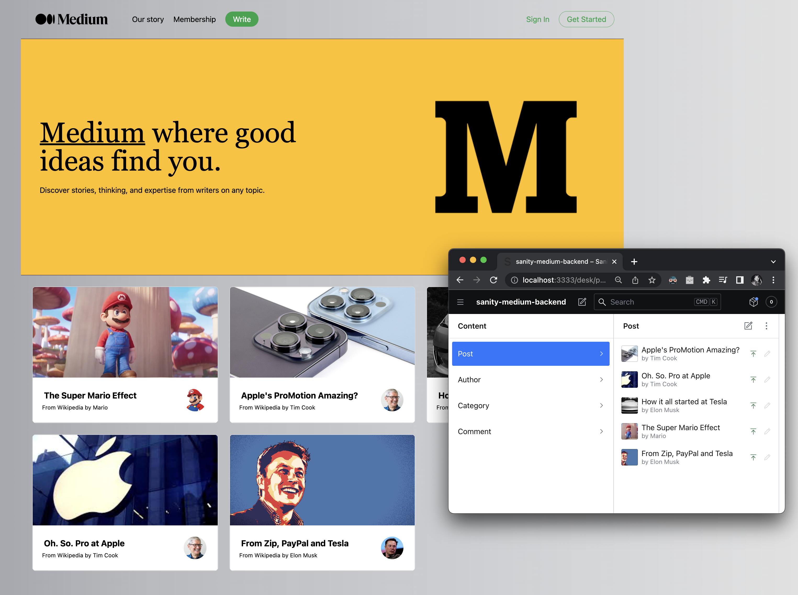

## Instagram clone (with firebase)

> A blogging webapp demonstrating the interaction with sanity and Next.js.



Featuring:

- A [Next.js](https://nextjs.org/) project bootstrapped with [`create-next-app`](https://nextjs.org/docs/api-reference/create-next-app).
- Added tailwindcss support by following the [Install Tailwind CSS with Next.js](https://tailwindcss.com/docs/guides/nextjs) guide.
- All blog posts are managed in a [sanity](https://github.com/sanity-io/next-sanity) backend.
- Configuration in the `sanity.js` file exports hooks like `sanityClient` used to query the sanity service.
- File `typings.d.ts` holds all our prop type `interface` definitions.

Pre-Rendering

JS frameworks like React, Vue popularized client-side rendering (CSR). This is a
rendering method where the server sends a HTML shell and a bundle.js. That code
then runs in the browser, updating HTML document in a process called "hydration"
But since rendering happens on the user's device (CSR) applications can be slow.
Next.js provides a solution through "pre-rendering". Instead of building the UI
on the client-side (CSR), Next.js builds it in advance on the server.

There are two types of pre-rendering we use in this webapp:

- 1. Server-side rendering (SSR)

In SSR the server builds the HTML, fetches all dynamic content and then sends it
to the browser. The server does this for every incoming request. SSR, therefore,
best used for constantly changing data. But SSR pages can be slower depending on
the amount of data the application needs to fetch from the server and the server
performance level. Through `getServerSideProps` in Next.js, you can use SSR only
for pages within your `pages` folder, that need it. See `index.tsx`.

- 2. Static Site Generation (SSG)

With SSG, the app prefetches all data during build. It then generates all HTML
pages and serves them for multiple requests. It’s very fast because, once server
has generated all the pages, a CDN can be used to cache and serve them. Because
of this, (SSG) is perfect for "static pages" like landing pages, blog posts. For
static pages consuming data from APIs, Next allows you to fetch the data during
build time using `getStaticProps`. See `post/[slug].tsx`.

Dependencies:

```json
"dependencies": {
  "@portabletext/react": "^2.0.0",
  "@sanity/image-url": "^1.0.1",
  "next": "latest",
  "next-sanity": "^1.0.9",
  "react": "18.2.0",
  "react-dom": "18.2.0",
  "react-hook-form": "^7.39.3",
  "react-portable-text": "^0.5.1"
},
```

Regards, <br />
Luigi Lupini <br />
<br />
I ❤️ all things (🇮🇹 / 🛵 / ☕️ / 👨‍👩‍👧)<br />

This is a [Next.js](https://nextjs.org/) project bootstrapped with [`create-next-app`](https://github.com/vercel/next.js/tree/canary/packages/create-next-app).

## Getting Started

First, run the development server:

```bash
npm run dev
# or
yarn dev
```

Open [http://localhost:3000](http://localhost:3000) with your browser to see the result.

You can start editing the page by modifying `pages/index.js`. The page auto-updates as you edit the file.

[API routes](https://nextjs.org/docs/api-routes/introduction) can be accessed on [http://localhost:3000/api/hello](http://localhost:3000/api/hello). This endpoint can be edited in `pages/api/hello.js`.

The `pages/api` directory is mapped to `/api/*`. Files in this directory are treated as [API routes](https://nextjs.org/docs/api-routes/introduction) instead of React pages.
